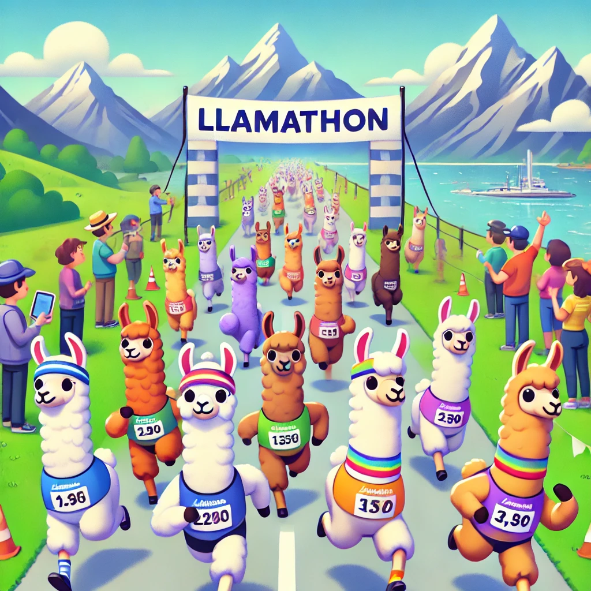

# Llamathon

Welcome to **Llamathon**, the ultimate platform for creative minds to come together and craft the best prompts in a fun and engaging environment. Inspired by hackathons, Llamathons focus on the art of writing prompts rather than code, making it perfect for AI-shy users who love to challenge their creativity.

## What is Llamathon?
Llamathon is a tool designed to help you organize and run your own prompt-writing marathons. Participants can select from a list of intriguing challenges, write their best prompts, and compete to see whose creativity stands out the most. Llamathon is the perfect way to bring people together.

## Seamless Integration
Llamathon is designed to integrate effortlessly with:
- **Herding-Llamas**: 
- **Llamatization**: 

